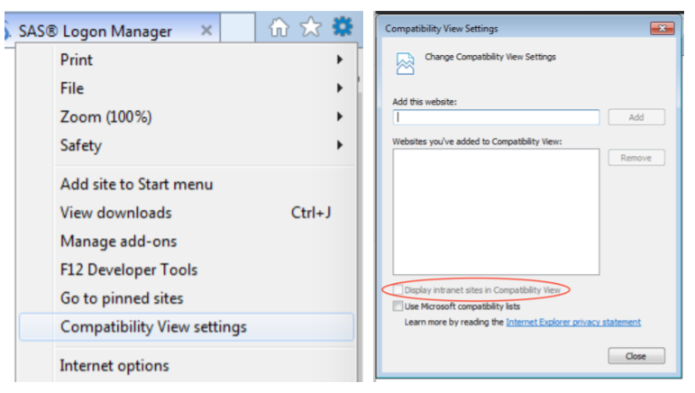

# Data Controller for SAS® - Troubleshooting

## Overview
[Let us know](https://datacontroller.io/contact/) if you experience an installation problem that is not described here!

## Internet Explorer - blank screen
If you have an older, or 'locked down' version of Internet Explorer you may get a blank / white screen when navigating to the Data Controller url.  To fix this, click settings (cog icon in top right), *Compatibility View settings*, and **uncheck** *Display intranet sites in Compatibility view* as follows:


## Workspace Server Type Only
Data Controller requires the OS account to have disk write privileges for a number of reasons:

* log capture
* folder creation (initial setup)
* table creation (demo version)
* writing staging data (editors)
* updating databases / datasets (approvers)

On Viya, this is the default case.

On SAS 9, if your Stored Process Shared Server account (typically `sassrv`) is unavailable, or overly restricted, you may need to use a Workspace Server account for your STPs.  This means that your Approvers must have the requisite access to perform the database updates.

The imported version of Data Controller is set up to work with the Stored Process Server.  To switch this to Workspace Server, you can run the following code *after* importing the SPK:

```
/* get the macros (or download / %include seperately) */
filename mc url "https://raw.githubusercontent.com/sasjs/core/main/all.sas";
%inc mc;

/* put the path to your Data Controller folder here */
%let DCROOT=/YOUR/META/PATH/DataController;

/* this will extract all the objects in that folder */
%mm_getfoldertree(root=&dcroot, outds=stps)

/* this creates the program to update all the STPs in that folder */
filename tmp temp;
data _null_;
  set stps;
  file tmp;
  if publictype='StoredProcess' then do;
  str=cats('%mm_updatestpservertype(target='
   ,path,'/',name,',type=WKS)');
  put str;
  end;
run;

/* run the program */
%inc tmp;
```

## Custom Library

If you wish to change the default *libref* or *libname* then there are TWO items to configure:

1) The library itself

2) The `mpelib` macro variable and the libname statement in the `/Admin/Data_Controller_Settings` stored process.

!!! note
    Be sure to make this change *after* running the configurator, to ensure the tables are first registered!


## Permission is needed to access the ServerContext Object

After a successful install, your business user may see the following message:


> Error obtaining stored process from repository
>
> Permission is needed to access the ServerContext object attached to the stored process.

The reason is that the context chosen when importing the SPK (perhaps, SASApp) is not available to your business user.  It's likely you have multiple contexts.

The SPK must be re-imported with the correct context chosen.  This may require regenerating the tables, or adjusting the permissions, if the new context uses a different system account.

## Stored Processes Cannot Be Imported Into A Project Repository

During the SPK import on a SAS 9 instance you may see the following dialog:


> Stored processes cannot be imported into a project repository

This can happen when importing with Data Integration Studio and your user profile is making use of a personal project repository. Try re-connecting with the Foundation repository, or import with SAS Management Console (which does not support project repositories).