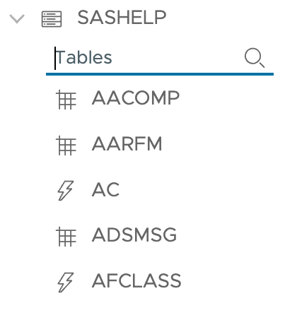

# Formats

Data Controller allows formats to be viewed and edited directly from the web interface - avoiding the need to create and maintain parallel 'CNTLIN' datasets.

Formats are displayed with a special icon (`bolt`), in the same library as other tables (in both the VIEW and EDIT screens):

Viewing or editing a format catalog will always mean that the entire catalog is exported, before being filtered (if filters applied) and displayed.  For this reason, it is recommended to split a large format catalog over several catalogs, if performance is a consideration.

The usual export mechanisms can also be applied - you can downlad the DDL, or export the catalog in CSV / Excel / Datalines / Markdown / DDL formats.

When adding a format to MPE_TABLES, the `DSN` should contain the format catalog name plus a `-FC` extension.  The LOADTYPE should be `FORMAT_CAT` and the BUSKEY should be `FMTNAME START`.  HOOK scripts can also be applied (ie, run some DQ after an edit, or re-run a batch job after an approval).

Example:

|LIBREF:$8.|DSN:$32.|LOADTYPE:$12.|BUSKEY:$1000.|
|---|---|---|---|
|`MYLIB `|`FORMATS-FC `|`FORMAT_CAT `|`FMTNAME START `|

Just like regular table edits, all changes to formats are logged in the `MPE_AUDIT` table.
