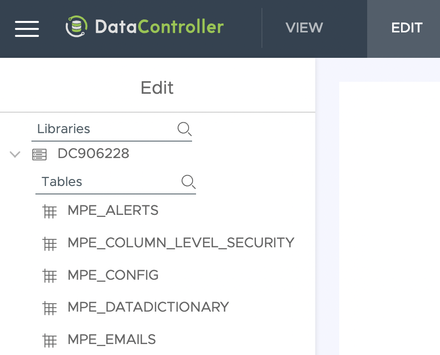

# Adding Libraries to Data Controller

The process for adding new libraries to Data Controller depends on whether we are talking about:

* The VIEW or EDIT menu
* Which flavour of SAS is being used

In VIEW mode, all available libraries are shown, unless the [DC_RESTRICT_VIEWER](/dcc-options/#dc_restrict_viewer) option is set.

In EDIT mode, only the libraries corresponding to the configuration in [MPE_TABLES](/dcc-tables) are visible.  This list may be shorter if the user is not in the [admin group](/dcc-groups/#data-controller-admin-group) or does not have the necessary [security](/dcc-security/) settings.

Flavour specific guidance is below.

## Viya Libraries

Library definitions should be added in the `autoexec.sas` of the designated Compute Context using Environment Manager.  

If the above is not feasible, it is possible to insert code in the `[DC Drive Path]/services/settings.sas` file however this will have a performance impact due to the additional API calls.

## SAS 9 EBI Libraries

In most cases, libname statements are NOT required, so long as they are accessible in metadata.

For the VIEW menu, the libname statement is made using the [mm_assignlib](https://core.sasjs.io/mm__assignlib_8sas.html) macro (META engine).  It is important that each library has a unique (up to 8 char) LIBREF.

For the EDIT menu, direct libname statements are derived using the [mm_assigndirectlib](https://core.sasjs.io/mm__assigndirectlib_8sas.html) macro.

If metadata extraction is not possible, libname statements may be added to the `[DC Meta Path]/services/public/Data_Controller_Settings` Stored Process.

## SASjs Server Libraries

New library definitions can be added in the `[DC Drive Path]/services/public/settings.sas` Stored Program.
